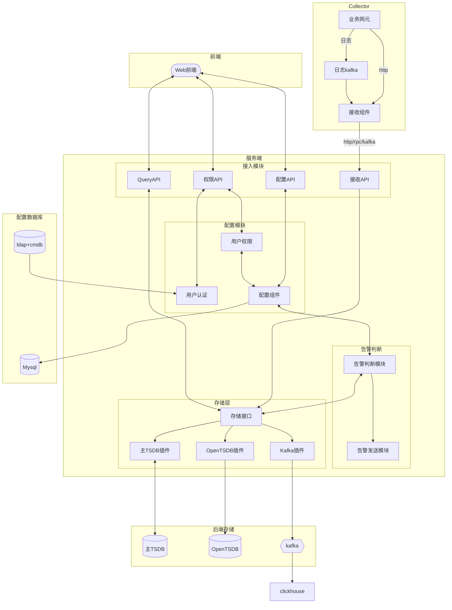
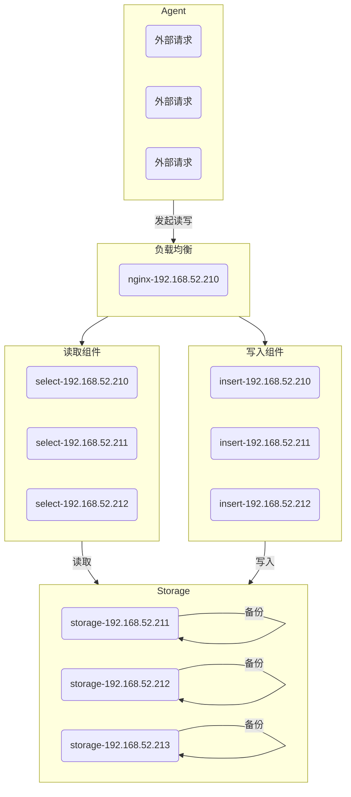

# 聚好看运维指标系统

## 一、整体架构



## 二、功能需求

### 接收业务指标

以现有业务 metric 接收程序为基础开发

1. 提供 http 接口, 兼容 falcon/夜莺接口, tags 支持字符串与字典两种模式
2. 接收 kafka topic 中 metric, 场景: 业务网元日志通过 fluntbeat 消费到 kafka
3. 白名单功能, 非认证 endpoint/ident 丢弃.
4. tags 注册或过滤垃圾 tags, 如时间戳, uuid 等垃圾 tag(优先级低)

### 可视化指标查询

1. 基于 promsql 查询
2. 基于表单 (metric/tags) 查询
3. 前端图表展示 metric

### 用户管理

1. 用户系统对接运维 ldap
2. 用户权限控制与页面隔离

### 告警配置

1. 告警判断配置使用 promsql, 告警判断
2. 告警发送组件为订阅机制, 基于 metric/tag 筛选告警, 发送到指定组(类型 fmp 告警邮件)
3. 告警通道支持邮件, 信鸿机器人

### 后端存储

1. 后端存储支持多路存储, 可配置
2. 支持 opentsdb 便于运维 grafana 画图
3. 后端存储通道支持 kafka 写入, 场景: 指标系统---> kafka --> spark --> clickhouse --> aiops 分析

主存储(用于日常告警判断)选型:
兼容 promql 或有 promeql adapter,
新型 tsdb 大多支持(或插件)支持 prometheus remote_write/remote_read 接口, prometheus 直接存储 TSDB, 页面支持查询

调研的数据库, 按顺序排名:

1. VictoriaMetrics (推荐)
2. influxdb 兼容性稍差
3. m3db 资源消耗搞, 不适合长期存储
4. taosdb 放弃
5. questdb 放弃

### 智能运维相关

1. 数据源支持查询 Prometheus 与运维监控 tsdb
2. 基于特定 metric 趋势预测

## 三、部署架构

### 数据采集部分

#### 1、http 接口

api：/v1/push
port：1988
可以混用
method：POST
body：json 数组 [serviceInfo1, serviceInfo2...]
请求样例：<font color="red">body 是个数组</font>

```json
[
  {
    "metric": "lvs_status",
    "endpoint": "superapp-launcher-njbp-api",
    "timestamp":  1234567890,   时间戳单位：秒
    "value": 1.22,
    "counterType": "GAUGE",
    "tags": {"a":1, "b":2, "c":3}
  }
]
```

字段说明：
1、 `metric` 必填，长度小于 128, **仅限这些字符**，[a-z0-9A-Z_]，起始字符不支持数字
2、 `endpoint` 必填, 填写租户项目，先到运维注册；
3、`counterType`，默认 GAUGE。可选值：GAUGE | COUNTER
4、`tags` 长度不超过 512，key 数量不超过 20 个。兼容 falcon，既可以是 a=1,b=2 的字符串，也可以是字典{"a":1, "b":2, "c":3}。key 起名要求同 metric： **仅限这些字符**，[a-z0-9A-Z_]，起始字符不支持数字；value 为 unicode
5、时间戳不能超过当前时间 5 分钟；可以小于当前时间，且没有时长限制。即，数据不能来自未来
6、`value` 仅限数字，即整型、浮点

返回值就是字符串。成功："推送成功"；失败：返回失败原因
返回是否正常，看状态码。非`200`全异常

#### 2、kafka 读取

<font color="red">注意：`kafka` 的数据格式，务必要和 `http` 的一样。如果不一样，要在 spark 上进行修改。</font>

#### 3、agent 采集

采用 `telegraf` 搜集，目前看用不到。
`telegraf` 内置了大量系统数据采集插件，同时支持多种数据上报格式。

### 存储部分

VictoriaMetric
外部请求通过 `nginx` 进入，`nginx` 可以配置 `lvs` 提高可用性。
`nginx` 配置 `insert` 和 `select` 两种操作接口，分别访问 `insert` 和 `select` 组件，进行写入和读取操作。
`insert` 和 `select` 都是无状态组件，可随时扩缩容。
后端 `storage` 三个，保证数据至少有一个备份。

整个系统可以入云。重点解决 storage 这个有状态服务即可。



### 告警相关、画图相关

告警：采用夜莺 v5 的前后端。配置好分组，直接用。
画图：grafana
