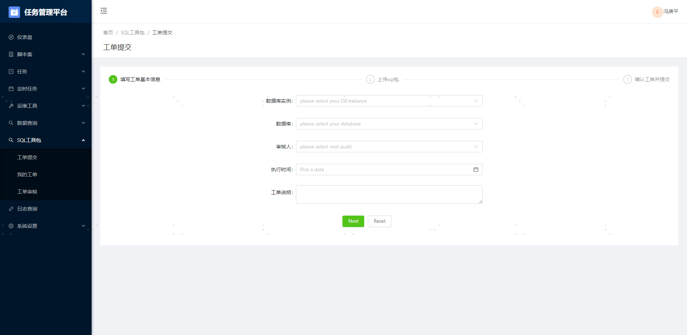
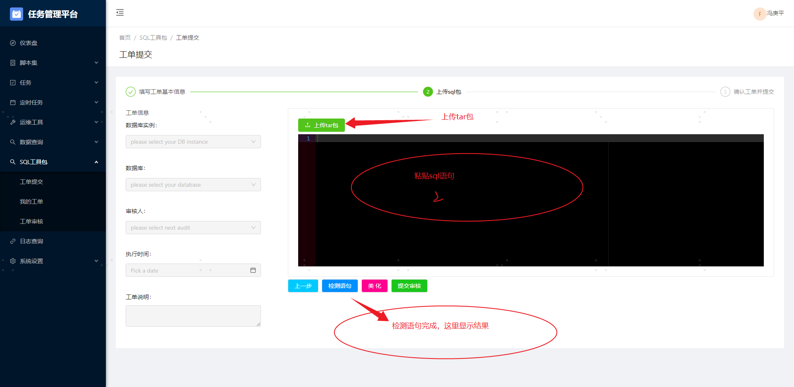

# sql 工具包可视化上线工具

## 一、使用场景


### 1.1 创建任务

1、定义任务名称
2、指定目标数据库

~~3、填写工具包流程编号~~
4、上传压缩包，或者直接粘贴 sql 语句


### 1.2 审核

1、审核数据库信息
2、审核 sql 语句

### 1.3 执行

1、有执行结果
2、有错误信息，最好标注清楚哪一句——可以实现，但是最小单位是 sql，不是数据条目

## 二、问题

### 2.1 上传文件类型

规定死是 tar 包？还是未压缩的原文件？
<font color="red">跟张继宽讨论的：tar 包没有意义。之前用 tar 包是为了打包发布方便，现在有页面，直接复制就行。如果 sql 特别多，就考虑在测试环境把数据做好，然后复制到线上，这就是另一个路径了</font>

### 2.2 tar 包内文件内容定义

当前使用形式：
当前 tar 包至少有两个文件，一个是 sql 内容，一个是执行脚本。sql 文件至少一个，即完全可能出现多个 sql 文件，这里就有顺序的问题。
要求，sql 文件必须要在文件名上标注序号——"[0-9][0-9]\_"
去掉执行脚本，或者程序自动忽略。程序只去找数字开头的文件。
<font color="red">执行需要手动点,哪怕审核完成,也要手动点</font>

### 2.3 上传的文件是否要保留

这个工具包在 svn 上都有，保留的意义在于追溯是否上传错了。之前手动操作的时候，没有明确规范
<font color="red">保留</font>

### 2.4 sql 语句的展示

在审核阶段，审核人是否要看到全部的 sql？
sql 工具包内的 sql 语句数量不定，可能只有一句，可能有一堆。要如何定夺
<font color="red">要能看到所有的</font>

### 2.5 加邮件通知

### 2.6 审核组

devops 组提交
~~单独拉一个审核组~~
可以指定下一步审核人

<font color="red">直接指定审核人,不管是谁</font>

### 2.7 审核流程

~~开发提交-->开发领导审核-->测试审核-->测试领导审核-->运维负责人审核-->运维领导审核-->按时执行~~
这个流程太长了

<font color="red">提交-审核-执行</font>

### 2.8 审核输入

~~目前 sql 审核只能一句一句审核。~~
~~如果一次有多条 sql，只能一条一个结论~~

### 2.9 回滚原则

只展示回滚语句,不提供执行功能

#### 2.9.1 创建表怎么回滚

#### 2.9.2 update 怎么回滚

#### 2.9.3 drop 表怎么回滚

#### 2.9.4 insert 怎么回滚

#### 2.9.5 多条 sql 执行了一半怎么回滚

### 2.10 中断

发现 sql 执行有问题,要能够人工干预中断进程

<font color="red">2.9 一系列问题统一结论：
回滚的问题，goInception 都支持。创建表回滚就把表删掉；update 会记录原值；drop 不支持；insert 有 delete。
多条 sql 执行过程中，按 sql 为单位。中断后，会将当前 sql 执行完毕，然后断掉。
</font>

## 三、页面

### 3.1 工单展示页面

仅展示相关工单

### 3.2. 工单提交页面

#### 3.2.1 选择数据库

#### 3.2.2 上传 sql 包

一个工具包可能有多个 tar 包，
一个 tar 包里面可能有多个 sql 文件，
一个 sql 文件里面可能有多条 sql

#### 3.2.3 指定审核人员

运维审核部分可以直接根据项目责任人来指定运维审核人员
前面开发、测试的不行。

#### 3.2.4 指定执行时间

定时任务扫描，超过预定时间就执行。
这样执行时间是一组固定时间点，并非指定的时间。

### 3.3. 工单审核页面

#### 3.3.1 sql 展示

目标数据库、sql 语句、审核结果

#### 3.3.2 审核按钮

必须点了审核，才能到下一步
审核目前没有确定的内容，都是人家做好的

#### 3.3.3 驳回按钮

#### 3.3.4 废弃按钮

## 四、部分逻辑

### 4.1 审核

定义 assigned 和 relevant 两个字段，assigned 为当前操作人、relevant 为相关人员。
relevant 会包含 assigned
审核为串行，驳回和废弃通过 status 字段的值来判定。当前所处步骤也通过 status 来判定

### 4.2 审核模板

固化下来，通过预置的形式写死，不允许自己配置

### 4.3 执行结果

异步处理。前端标记状态，后台执行，执行完成后修改标志位，前端查看。

### 4.4 中断处理

当任务处于执行中的状态，允许中断。中断方法：

1. 任务要记录目标数据库，同时要给各个线上库创建一个专用执行用户
2. 通过库名和执行用户名，确定当前正在执行的 processlist。拿到 process id
   ```sql
   select * from information_schema.PROCESSLIST where db = 'yearning' and user = 'root';
   ```
   执行这句话的用户，不能是专用执行用户。不然这里一定会有两条数据，不过都 kill 了也没什么大问题。
3. goInception 在被 kill 的时候，当前执行语句会提示执行失败，后续语句将返回检查结果，不执行
4. 这里还有个问题
   如果不是因为卡住而终止。这种方法没用。获取 id 是要耗费时间的，这个时间一定比执行 sql 的速度慢。
   如果要 kill session，需要 tcpkill 这个命令。都没装。
   再者，tcpkill 需要知道当前连接是哪一个，判断依据是端口号。这个端口号还是得从 show processlist 获取，一样跟不上速度。
5. 4 的问题解决方案
   goInception 自己的库，端口 4000 那个，进去。——可以用 pymysql 进去。调用 goInception 的时候，user 自己写一个特殊的，就能通过这个 user 来找你操作的语句

   ```sql
   select * from PROCESSLIST where user = 'kjasfkjasfkjlas' and state = 0;
   ```

   `state = 0`表示正在执行

   | ID  | USER            | HOST          | DB  | COMMAND | TIME | STATE | Info                              |
   | --- | --------------- | ------------- | --- | ------- | ---- | ----- | --------------------------------- |
   | 102 | kjasfkjasfkjlas | 10.18.102.159 |     | EXECUTE | 48   | 0     | insert into t1(id,c1) values(8,1) |

   就能看到当前任务，找 Dest_host 和目标数据库一致且 STATE 为 EXECUTING 的 id

   ```sql
   kill 102
   ```

   此时，会把当前已经进去的 sql 执行完毕，然后退出。
   这个 process，一次调用一个。不管里面含有多少个 sql。
   还是得两个环节，先拿 id，然后再过去 kill。
   这里还要注意一个问题：

   1. sql 语句，是最小分割单位。如果是 update 全表，那就停不下来，因为 sql 只有一句。
   2. 如果要停，那还得进 mysql，用执行的 sql，找出当前 processid，然后 kill。
