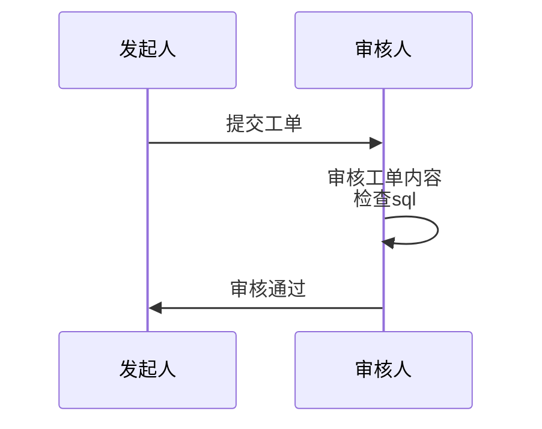
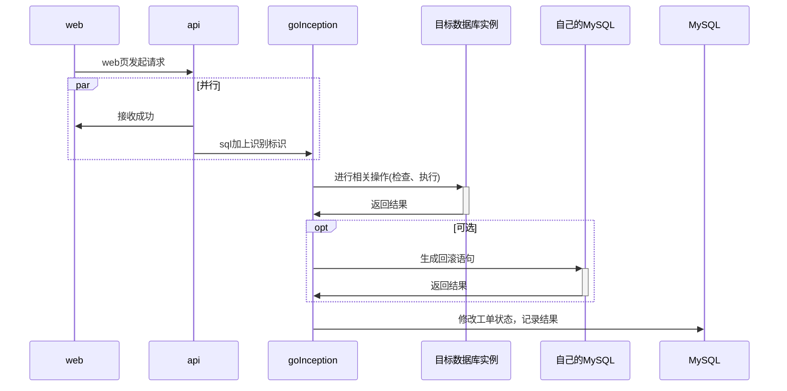
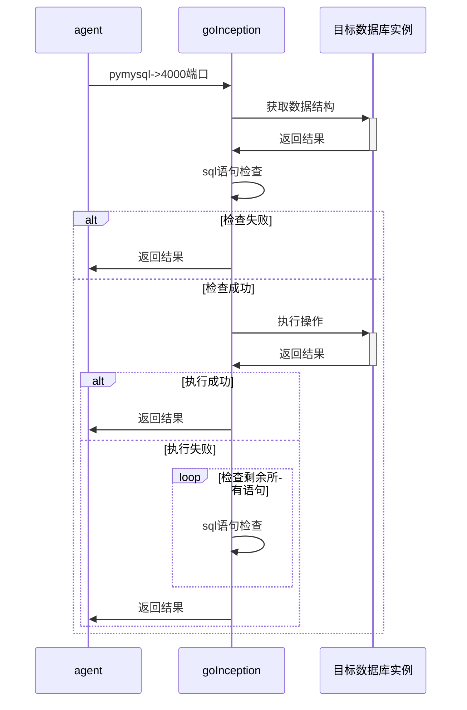
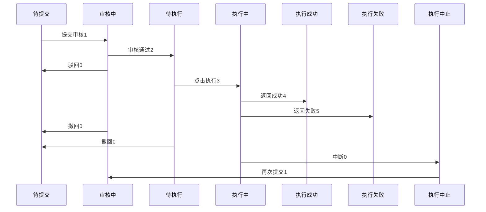
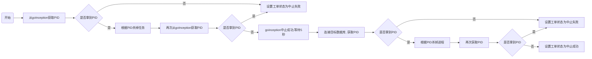

# sql 工具包可视化上线工具

## 一、功能概述

### 1.1 工单创建

工单是对数据库进行操作的基础单元。所有数据操作均建立在工单基础之上。
~~**支持上传多个 tar 包**~~
基本要素：

- 目标对象
- 目标数据库
- sql 语句
- 审核人
- 当前状态

附加要素：

- 说明
- koa 流程 ID

基本要素完备，才可以创建工单。附加要素作为选填项存在。

### 1.2 工单审核

工单审核包含**对工单信息的确认**，和**对 sql 语句合法性的判断**。
基本要素：

- 审核人

审核人由工单创建者自行指定，建议指定可以对其行为负责的上级领导。固定死某个组审核
审核人可以通过，或者驳回。

##### 流程合法性：

##### sql 语句合法性的检查:

### 1.3 工单执行

根据工单信息，执行 sql 语句，并返回执行结果和回滚建议。
系统在后台自动执行，不需要人工干预

### 1.4 工单中断

对处于执行状态的工单进行中止操作。

### 1.5 通知

当工单状态改变，向相关人员发送邮件通知。

## 二、页面安排

### 2.1 工单创建页面

工单创建页面包含三个子页面，以步骤条形式展示

- 基本信息填写
  完成除 sql 语句的所有信息的填写
- sql 语句填写
  支持 sql 直接粘贴和上传 tar 包。二选一
  进行 sql 审核，判断 sql 是否合法、能否执行——这里的审核不绝对保证可以。数据库内部数据问题，审核是分辨不出来的
- 通知提交成功
  无实际操作

tar 包有目录层级,按照 namespace 存.
建议不支持 tar 包,直接复制 sql

### 2.2 工单审核详情页

工单审核页面同 sql 语句填写页面。区别在于没有语句上传

### 2.3 我的工单

表格，仅显示当前登录账号相关的工单。每行有按钮“工单信息”，可跳转至工单详情页

### 2.4 工单审核

表格，同工单列表页。区别在于此处仅显示需要当前账号审核的工单

## 三、审核及执行逻辑

审核组件采用开源 sql 审核项目 goInception，需要单独部署。

### 3.1 goInception 使用问题

- 不管是审核还是执行，最小单元都是 sql 语句。审核对象、执行对象、中断对象都是 sql。
  如果一个 sql 涉及的行数太多，而执行过程中有发现问题，这是无法正常终止的。必须登录 mysql，kill processId
  针对大量 sql 和慢 sql 两种处理方法,都要有
  解决方案：
  1. 如果是大量 sql，暂停就使用 goInception 的逻辑。当前语句执行完毕后，终止
  2. 如果是单 sql，但是修改的行数多。此时则登录目标数据库获取 processId，然后 kill 掉
  3. 综合上述两种情况，停止任务先走 goInception 逻辑，等待 1 秒，然后登录数据库获取 processId 然后 kill
- 审核通过不代表一定能执行成功
  审核无法访问数据库内部数据，如果 sql 操作进行数据修改，无法检查出数据上的冲突。例如主键冲突。
- 执行成功后，会进行回滚语句的写入。这个时间大致等于执行时间。
  即，采用 goInception 后，执行时间会加倍
  是否生成回滚语句可以自行决定
- 回滚语句生成的单位是(被修改的)行。不管执行的语句是几条，回滚语句一定是一条回滚语句对应一行被修改的数据。
  当修改的数据行数太多，回滚语句也会很多，占用空间较大
  定期清理
- goInception 所有的记录，都在数据库里面。包括执行记录和回滚语句
- goInception 支持中断操作，但当前正在执行的 sql 不受影响，一定会执行完毕，然后停

### 3.2 执行

- goInception 审核 具体机制要查一下：**审核几乎不占用目标数据库资源**
- 执行
- 备份
- 执行过程中失败，执行中止，剩余语句进行审核操作
- 备份环节失败，不影响执行结果
- 所有环节结束，返回结果。包括执行结果和审核结果

## 四、使用流程

申请人填写必要信息，上传 sql，指定审核人；
审核人审核；
申请人执行。

审核必须要点击“审核”按钮，才能到下一步；
执行必须要申请人点击执行，才能开始执行。

## ~~五、信息备份~~

~~上传的 tar 包会保留一份~~
~~回滚语句存在独立数据库中~~

## 五、工单状态

## 中止逻辑

