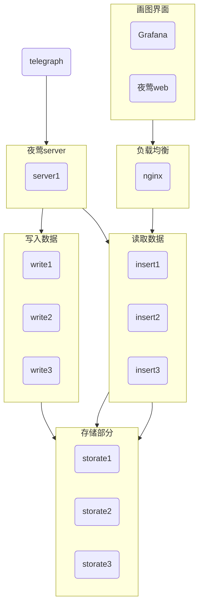

# 运维指标系统部署方案

## 一、总体框架流程

说明：

1. 写入为什么要经过夜莺 server
   victoriaMetric 是允许 agent(telegraph)直接通过 nginx 写入数据的，但是这里必须要经过夜莺 server。
   因为如果不经过夜莺，在夜莺上就无法进行告警数据的分组管理。对于后续各个项目组查看自己的数据有影响
   如果不做分类要求，就可以直接走 nginx。对数据画图、告警设置都不影响
2. 高可用保障
   所有黄色框的内容都可以横向扩展。
   存储部分有特殊性，仅可以扩，不可以缩。可靠性公式为：`节点数量=2N-1(N 为副本数),允许挂掉的节点数为N-1`
3. 入云情况
   读写组件都是无状态网元，可以入云。
   存储需要测试，初步设想是不入云。入云的话，有两个问题要解决：
   1. insert 和 select 在启动的时候要指定存储的地址，如果这里写外部服务名或者内部服务名是否可以？
      我觉得是不可以的，容器云在这部分的逻辑认为 deployment 内的 pod 是平等的，而实际上作为存储，他们必然是不一样的。不一样的话，这个启动命令要怎么写？
   2. 作为有状态服务启动是否可以？
      目前不了解有状态服务的具体运行方式，不做讨论
4. telegraph 部署
   同夜莺和 falcon 的 agent 的部署方式。通过 ansiable 分发。
   这里要注意一个地方。telegraph 中 host 参数要根据各个服务器进行修改。夜莺有通用方法；falcon-agent 部署的时候，貌似已经解决这个问题了。

## 二、入云组件

insert、select、nginx、n9e-v5-server、n9e-v5-webapi
这里面 n9e-v5 的 server 和 webapi 是同一个程序，只是启动时的参数不一样。不过还是要分成两个服务
注意：

- select 和 insert 的启动命令。都要带着 storage 的地址

## 三、当前要解决的问题

1. telegraph 日志问题
   telegraph 的日志目前是打印到系统日志里面了。需要让它按照配置中的指定路径打印。
2. dockerfile 的编写
   问题不大。
3. storage 入云
   如果要入云，就得解决第一章的两个问题。
