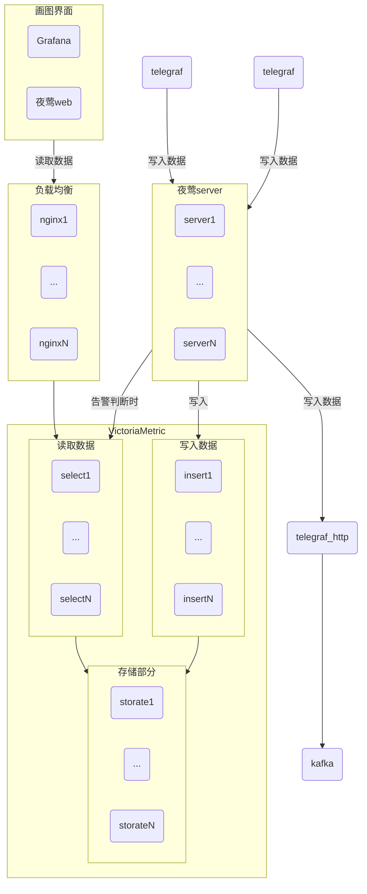

# 运维指标系统部署方案

## 一、总体框架流程



## 二、组件部署

### 1. 夜莺

#### 安装包

夜莺 server 端和 web 端的安装包是同一个，只需要编译一次即可。
注意：不要用官方编译的包。官方编译的包没有把 lib 库都包进去，你的安装环境如果没有对应 lib 库，就用不了
编译命令：

```shell
CGO_ENABLED=0 GOOS=linux GOARCH=amd64 go build -ldflags="-s -w" -o n9e ./src
```

##### server

Dockerfile

```dockerfile
FROM alpine:3.14
LABEL MAINTAINER="juhaokan"

USER root
RUN sed -i 's/dl-cdn.alpinelinux.org/mirrors.ustc.edu.cn/g' /etc/apk/repositories \
    && apk --no-cache add bash ca-certificates curl gettext linux-pam openssh gnupg iproute2 bash-completion procps busybox-extras \
    && addgroup -g 800 hitv \
    && adduser -u 888 -D -H -S -s /bin/bash -G hitv hitv
RUN mkdir -p /opt/etc /opt/n9e-v5/logs
COPY n9e /opt/n9e-v5/
COPY etc /opt/n9e-v5/etc
COPY version /opt/n9e-v5/
COPY server.conf /opt/n9e-v5/etc/
RUN  chown -R hitv:hitv /opt/n9e-v5
LABEL logs.info="host:/opt/n9e-v5/logs" \
      health.type="tcp" \
      health.url="19000" \
      config.files="/opt/n9e-v5/etc/server.conf" \
      resource.cpu="1" \
      resource.memory="1024"

WORKDIR /opt/n9e-v5
RUN chmod +x n9e

USER 888
EXPOSE 19000
ENV APP="server"

ENTRYPOINT [ "sh", "-c" ]
CMD ["exec /opt/n9e-v5/n9e $APP 2>&1 | tee -a /opt/n9e-v5/logs/nohup.output"]
```

配置文件：

```conf
# debug, release
RunMode = "release"

# my cluster name
ClusterName = "Default"

# sleep x seconds, then start judge engine
EngineDelay = 120

[Log]
# log write dir
Dir = "logs"
# log level: DEBUG INFO WARNING ERROR
Level = "INFO"
# stdout, stderr, file
Output = "stdout"
# # rotate by time
# KeepHours: 4
# # rotate by size
# RotateNum = 3
# # unit: MB
# RotateSize = 256

[HTTP]
# http listening address
Host = "0.0.0.0"
# http listening port
Port = 19000
# https cert file path
CertFile = ""
# https key file path
KeyFile = ""
# whether print access log
PrintAccessLog = false
# whether enable pprof
PProf = false
# http graceful shutdown timeout, unit: s
ShutdownTimeout = 30
# max content length: 64M
MaxContentLength = 67108864
# http server read timeout, unit: s
ReadTimeout = 20
# http server write timeout, unit: s
WriteTimeout = 40
# http server idle timeout, unit: s
IdleTimeout = 120

# [BasicAuth]
# user002 = "ccc26da7b9aba533cbb263a36c07dcc9"

[Heartbeat]
# auto detect if blank
IP = ""
# unit ms
Interval = 1000

[SMTP]
Host = "smtp.163.com"
Port = 994
User = "username"
Pass = "password"
From = "username@163.com"
InsecureSkipVerify = true
Batch = 5

[Alerting]
TemplatesDir = "./etc/template"
NotifyConcurrency = 10
# use builtin go code notify by default
NotifyBuiltinEnable = true

[Alerting.CallScript]
# built in sending capability in go code
# so, no need enable script sender
Enable = false
ScriptPath = "./etc/script/notify.py"

[Alerting.RedisPub]
Enable = false
# complete redis key: ${ChannelPrefix} + ${Cluster}
ChannelPrefix = "/alerts/"

[Alerting.Webhook]
Enable = false
Url = "http://a.com/n9e/callback"
BasicAuthUser = ""
BasicAuthPass = ""
Timeout = "5s"
Headers = ["Content-Type", "application/json", "X-From", "N9E"]

[NoData]
Metric = "target_up"
# unit: second
Interval = 15

[Ibex]
# callback: ${ibex}/${tplid}/${host}
Address = "127.0.0.1:10090"
# basic auth
BasicAuthUser = "ibex"
BasicAuthPass = "ibex"
# unit: ms
Timeout = 3000

[Redis]
# address, ip:port
Address = "127.0.0.1:6379"
# requirepass
Password = ""
# # db
# DB = 0

[Gorm]
# enable debug mode or not
Debug = false
# mysql postgres
DBType = "mysql"
# unit: s
MaxLifetime = 7200
# max open connections
MaxOpenConns = 150
# max idle connections
MaxIdleConns = 50
# table prefix
TablePrefix = ""
# enable auto migrate or not
EnableAutoMigrate = false

[MySQL]
# mysql address host:port
Address = "127.0.0.1:3306"
# mysql username
User = "root"
# mysql password
Password = "root"
# database name
DBName = "n9e_v5"
# connection params
Parameters = "charset=utf8mb4&parseTime=True&loc=Local&allowNativePasswords=true"

[Postgres]
# pg address host:port
Address = "127.0.0.1:5432"
# pg user
User = "root"
# pg password
Password = "1234"
# database name
DBName = "n9e_v5"
# ssl mode
SSLMode = "disable"

[Reader]
# prometheus base url
Url = "http://127.0.0.1:8490/select/0/prometheus"
# Basic auth username
BasicAuthUser = ""
# Basic auth password
BasicAuthPass = ""
# timeout settings, unit: ms
Timeout = 30000
DialTimeout = 10000
TLSHandshakeTimeout = 30000
ExpectContinueTimeout = 1000
IdleConnTimeout = 90000
# time duration, unit: ms
KeepAlive = 30000
MaxConnsPerHost = 0
MaxIdleConns = 100
MaxIdleConnsPerHost = 10

[WriterOpt]
# queue max size
QueueMaxSize = 10000000
# once pop samples number from queue
QueuePopSize = 2000
# unit: ms
SleepInterval = 50

[[Writers]]
Url = "http://127.0.0.1:8490/insert/0/prometheus/api/v1/write"
# Basic auth username
BasicAuthUser = ""
# Basic auth password
BasicAuthPass = ""
# timeout settings, unit: ms
Timeout = 30000
DialTimeout = 10000
TLSHandshakeTimeout = 30000
ExpectContinueTimeout = 1000
IdleConnTimeout = 90000
# time duration, unit: ms
KeepAlive = 30000
MaxConnsPerHost = 0
MaxIdleConns = 100
MaxIdleConnsPerHost = 100

[[Writers]]
Url = "http://127.0.0.1:18080/telegraf"
# Basic auth username
BasicAuthUser = ""
# Basic auth password
BasicAuthPass = ""
# timeout settings, unit: ms
Timeout = 30000
DialTimeout = 10000
TLSHandshakeTimeout = 30000
ExpectContinueTimeout = 1000
IdleConnTimeout = 90000
# time duration, unit: ms
KeepAlive = 30000
MaxConnsPerHost = 0
MaxIdleConns = 100
MaxIdleConnsPerHost = 100
```

##### webapi

webapi 比 server 端多了静态文件，即 pub 目录及内容。pub 可从官网直接下载对应版本的 tar 包。
Dockerfile

```dockerfile
FROM alpine:3.14
LABEL MAINTAINER="juhaokan"

USER root
RUN sed -i 's/dl-cdn.alpinelinux.org/mirrors.ustc.edu.cn/g' /etc/apk/repositories \
    && apk --no-cache add bash ca-certificates curl gettext linux-pam openssh gnupg iproute2 bash-completion procps busybox-extras \
    && addgroup -g 800 hitv \
    && adduser -u 888 -D -H -S -s /bin/bash -G hitv hitv
RUN mkdir -p /opt/n9e-v5/pub /opt/etc  /opt/n9e-v5/logs
COPY n9e /opt/n9e-v5/
COPY pub /opt/n9e-v5/pub
COPY etc /opt/n9e-v5/etc
COPY webapi.conf /opt/n9e-v5/etc/
COPY version /opt/n9e-v5/
RUN  chown -R hitv:hitv /opt/n9e-v5
LABEL logs.info="host:/opt/n9e-v5/logs" \
      health.type="tcp" \
      health.url="18000" \
      config.files="/opt/n9e-v5/etc/webapi.conf" \
      resource.cpu="1" \
      resource.memory="1024"

WORKDIR /opt/n9e-v5
RUN chmod +x n9e

USER 888
EXPOSE 18000
ENV APP="wepapi"

ENTRYPOINT [ "sh", "-c" ]
CMD ["exec /opt/n9e-v5/n9e $APP 2>&1 | tee -a /opt/n9e-v5/logs/nohup.output"]
```

配置文件：

```conf
# debug, release
RunMode = "release"

# # custom i18n dict config
# I18N = "./etc/i18n.json"

# do not change
AdminRole = "Admin"

# metrics descriptions
MetricsYamlFile = "./etc/metrics.yaml"

[[NotifyChannels]]
Label = "邮箱"
# do not change Key
Key = "email"

[[NotifyChannels]]
Label = "钉钉机器人"
# do not change Key
Key = "dingtalk"

[[NotifyChannels]]
Label = "企微机器人"
# do not change Key
Key = "wecom"

[[NotifyChannels]]
Label = "飞书机器人"
# do not change Key
Key = "feishu"

[[ContactKeys]]
Label = "Wecom Robot Token"
# do not change Key
Key = "wecom_robot_token"

[[ContactKeys]]
Label = "Dingtalk Robot Token"
# do not change Key
Key = "dingtalk_robot_token"

[[ContactKeys]]
Label = "Feishu Robot Token"
# do not change Key
Key = "feishu_robot_token"

[Log]
# log write dir
Dir = "logs"
# log level: DEBUG INFO WARNING ERROR
Level = "DEBUG"
# stdout, stderr, file
Output = "stdout"
# # rotate by time
# KeepHours: 4
# # rotate by size
# RotateNum = 3
# # unit: MB
# RotateSize = 256

[HTTP]
# http listening address
Host = "0.0.0.0"
# http listening port
Port = 18000
# https cert file path
CertFile = ""
# https key file path
KeyFile = ""
# whether print access log
PrintAccessLog = true
# whether enable pprof
PProf = false
# http graceful shutdown timeout, unit: s
ShutdownTimeout = 30
# max content length: 64M
MaxContentLength = 67108864
# http server read timeout, unit: s
ReadTimeout = 20
# http server write timeout, unit: s
WriteTimeout = 40
# http server idle timeout, unit: s
IdleTimeout = 120

[JWTAuth]
# signing key
SigningKey = "5b94a0fd640fe2765af826acfe42d151"
# unit: min
AccessExpired = 1500
# unit: min
RefreshExpired = 10080
RedisKeyPrefix = "/jwt/"

[BasicAuth]
user001 = "ccc26da7b9aba533cbb263a36c07dcc5"

[AnonymousAccess]
PromQuerier = false
AlertDetail = false

[LDAP]
Enable = false
Host = "ldap.example.org"
Port = 389
BaseDn = "dc=example,dc=org"
# AD: manange@example.org
BindUser = "cn=manager,dc=example,dc=org"
BindPass = "*******"
# openldap format e.g. (&(uid=%s))
# AD format e.g. (&(sAMAccountName=%s))
AuthFilter = "(&(uid=%s))"
CoverAttributes = true
TLS = false
StartTLS = true
# ldap user default roles
DefaultRoles = ["Standard"]

[LDAP.Attributes]
Nickname = "cn"
Phone = "mobile"
Email = "mail"

[Redis]
# address, ip:port
Address = "127.0.0.1:6379"
# requirepass
Password = ""
# # db
# DB = 0

[Gorm]
# enable debug mode or not
Debug = true
# mysql postgres
DBType = "mysql"
# unit: s
MaxLifetime = 7200
# max open connections
MaxOpenConns = 150
# max idle connections
MaxIdleConns = 50
# table prefix
TablePrefix = ""
# enable auto migrate or not
EnableAutoMigrate = false

[MySQL]
# mysql address host:port
Address = "127.0.0.1:3306"
# mysql username
User = "root"
# mysql password
Password = "root"
# database name
DBName = "n9e_v5"
# connection params
Parameters = "charset=utf8mb4&parseTime=True&loc=Local&allowNativePasswords=true"

[Postgres]
# pg address host:port
Address = "127.0.0.1:5432"
# pg user
User = "root"
# pg password
Password = "1234"
# database name
DBName = "n9e_v5"
# ssl mode
SSLMode = "disable"

[[Clusters]]
# Prometheus cluster name
Name = "Default"
# Prometheus APIs base url
Prom = "http://127.0.0.1:8490/select/0/prometheus"
# Basic auth username
BasicAuthUser = ""
# Basic auth password
BasicAuthPass = ""
# timeout settings, unit: ms
Timeout = 30000
DialTimeout = 10000
TLSHandshakeTimeout = 30000
ExpectContinueTimeout = 1000
IdleConnTimeout = 90000
# time duration, unit: ms
KeepAlive = 30000
MaxConnsPerHost = 0
MaxIdleConns = 100
MaxIdleConnsPerHost = 100

[Ibex]
Address = "http://127.0.0.1:10090"
# basic auth
BasicAuthUser = "ibex"
BasicAuthPass = "ibex"
# unit: ms
Timeout = 3000
```

### 2、VictoriaMetric（存储）

包含三个组件：insert、select、storage。
他们是有启动顺序的，优先启动 storage。insert 和 select 后启动，它们之间无依赖关系。

#### package

需要自行重新编译，原因同上。
编译命令：

```shell
CGO_ENABLED=0 GOOS=linux GOARCH=amd64 go build -ldflags="-s -w" -o select ./app/vmselect/main.go
CGO_ENABLED=0 GOOS=linux GOARCH=amd64 go build -ldflags="-s -w" -o insert ./app/vminsert/main.go
CGO_ENABLED=0 GOOS=linux GOARCH=amd64 go build -ldflags="-s -w" -o storage ./app/vmstorage/main.go
```

storage 可以直接用官方编译好的，这个不入云。

##### insert

注意 storageNode 参数，这个参数是写到启动命令里面的，需要根据实际情况调整。
目前把它放到环境变量里面，方便后续修改。
同时注意端口号，insert 自身占用 8480，访问 storage 的 8400
Dockerfile

```dockerfile
FROM alpine:3.14
LABEL MAINTAINER="juhaokan"

USER root
RUN sed -i 's/dl-cdn.alpinelinux.org/mirrors.ustc.edu.cn/g' /etc/apk/repositories \
    && apk --no-cache add bash ca-certificates curl gettext linux-pam openssh gnupg iproute2 bash-completion procps busybox-extras \
    && addgroup -g 800 hitv \
    && adduser -u 888 -D -H -S -s /bin/bash -G hitv hitv
RUN mkdir -p /opt/victoriaMetric
COPY insert /opt/victoriaMetric/
COPY version /opt/victoriaMetric/
RUN  chown -R hitv:hitv /opt/victoriaMetric
LABEL health.type="tcp" \
      health.url="8480" \
      resource.cpu="1" \
      resource.memory="1024"

WORKDIR /opt/victoriaMetric
RUN chmod +x insert

USER 888
EXPOSE 8480 4242
ENV STORAGENODE="192.168.52.210:8400,192.168.52.211:8400,192.168.52.212:8400" \
    REPLICATIONFACTOR="2" \
    OPENTSDBHTTPLISTENADDR=":4242" \
    MAXLABELSPERTIMESERIES="64"


ENTRYPOINT [ "sh", "-c" ]
CMD ["exec /opt/victoriaMetric/insert -storageNode=$STORAGENODE -replicationFactor=$REPLICATIONFACTOR -opentsdbHTTPListenAddr=$OPENTSDBHTTPLISTENADDR -maxLabelsPerTimeseries=$MAXLABELSPERTIMESERIES 2>&1 | tee -a /opt/victoriaMetric/nohup.output"]
```

##### select

注意 storageNode 参数，这个参数是写到启动命令里面的，需要根据实际情况调整。
目前把它放到环境变量里面，方便后续修改。
同时注意端口号，insert 自身占用 8481，访问 storage 的 8401
Dockerfile

```dockerfile
FROM alpine:3.14
LABEL MAINTAINER="juhaokan"

USER root
RUN sed -i 's/dl-cdn.alpinelinux.org/mirrors.ustc.edu.cn/g' /etc/apk/repositories \
    && apk --no-cache add bash ca-certificates curl gettext linux-pam openssh gnupg iproute2 bash-completion procps busybox-extras \
    && addgroup -g 800 hitv \
    && adduser -u 888 -D -H -S -s /bin/bash -G hitv hitv
RUN mkdir -p /opt/victoriaMetric
COPY select /opt/victoriaMetric/
COPY version /opt/victoriaMetric/
RUN  chown -R hitv:hitv /opt/victoriaMetric
LABEL health.type="tcp" \
      health.url="8481" \
      resource.cpu="1" \
      resource.memory="1024"

WORKDIR /opt/victoriaMetric
RUN chmod +x select

USER 888
EXPOSE 8481
ENV STORAGENODE="192.168.52.210:8401,192.168.52.211:8401,192.168.52.212:8401" \
    REPLICATIONFACTOR="2"

ENTRYPOINT [ "sh", "-c" ]
CMD ["exec /opt/victoriaMetric/select -storageNode=$STORAGENODE -replicationFactor=$REPLICATIONFACTOR -search.denyPartialResponse 2>&1 | tee -a /opt/victoriaMetric/nohup.output"]
```

##### storage

解压后，直接启动即可。
启动命令：
可执行文件名根据编译结果修改。
-storageDataPath 是数据存储地址，根据实际情况修改。

```shell
./vmstorage-prod -retentionPeriod=30d -storageDataPath=/data/victoriaMetric
```

### 3、nginx

配置文件 server.conf：
proxy_pass 根据实际服务名调整。当前占用了 80 端口，会和 nginx 自身的健康检查接口冲突，所以这里把健康检查的规则又配了一遍。

```conf
server {
    listen       80 ;

    location ~* /insert/[0-9]+/opentsdb {
        proxy_pass http://victoriametric-insert-svc_4242;
    }

    location ~* /insert {
        proxy_pass http://victoriametric-insert-svc_8480;
    }

    location ~* /select {
        proxy_pass http://victoriametric-select-svc_8481;
    }

    location / {
        return 200 "Welcome to nginx";
    }
}
```

### 3. telegraf（数据采集）

#### package

需要自行重新编译，原因同上。
编译命令：

```shell
go build -ldflags="-w -s" ./cmd/telegraf
```

telegraf 如无特殊情况，则没有监听端口。
Dockerfile
暴露端口要和配置文件一致

```dockerfile
FROM alpine:3.14
LABEL MAINTAINER="juhaokan"

USER root
RUN sed -i 's/dl-cdn.alpinelinux.org/mirrors.ustc.edu.cn/g' /etc/apk/repositories \
    && apk --no-cache add bash ca-certificates curl gettext linux-pam openssh gnupg iproute2 bash-completion procps busybox-extras \
    && addgroup -g 800 hitv \
    && adduser -u 888 -D -H -S -s /bin/bash -G hitv hitv
RUN mkdir -p /opt/telegraf /opt/telegraf/etc
COPY telegraf /opt/telegraf/
COPY telegraf.conf /opt/telegraf/etc/
COPY version /opt/telegraf/
RUN  chown -R hitv:hitv /opt/telegraf
LABEL resource.cpu="1" \
      resource.memory="1024"

WORKDIR /opt/telegraf
RUN chmod +x telegraf

USER 888
EXPOSE 18080
ENTRYPOINT [ "sh", "-c" ]
CMD ["exec /opt/telegraf/telegraf -config ./etc/telegraf.conf 2>&1 | tee -a /opt/telegraf/nohup.output"]
```

配置文件：
这是个全的，根据需要删改。

```
telegraf config > telegraf.conf
```

简化版：
必须要有 agent、input、output。一个输入一个输出
这个是采集 cpu 的数据发送到 opentsdb。

```conf
[global_tags]
  user = "$USER"
[agent]
  interval = "10s"
  round_interval = true
  metric_batch_size = 1000
  metric_buffer_limit = 10000
  collection_jitter = "1s"
  flush_interval = "10s"
  flush_jitter = "0s"
  precision = ""
  debug = true
  quiet = false
  logtarget = "file"
  logfile = "/var/log/telegraf/telegraf.log"
  logfile_rotation_interval = "1d"
  logfile_rotation_max_size = "100MB"
  hostname = ""
  omit_hostname = false
[[outputs.opentsdb]]
  host = "http://127.0.0.1"
  port = 19000
  http_path = "/opentsdb/put"
[[inputs.cpu]]
  percpu = true
  totalcpu = true
  collect_cpu_time = false
  report_active = false
```

这个是通过 http 接口采集 prometheus 格式的数据，发送给 kafka

```conf
[global_tags]
  user = "$USER"
[agent]
  interval = "10s"
  round_interval = true
  metric_batch_size = 1000
  metric_buffer_limit = 10000
  collection_jitter = "1s"
  flush_interval = "10s"
  flush_jitter = "0s"
  precision = ""
  debug = true
  quiet = false
  logtarget = "file"
  logfile = "/var/log/telegraf/telegraf.log"
  logfile_rotation_interval = "1d"
  logfile_rotation_max_size = "100MB"
  hostname = ""
  omit_hostname = false
[[outputs.kafka]]
  brokers = ["localhost:9092"]
  topic = "telegraf"
  routing_tag = "host"
  data_format = "json"
[[inputs.http_listener_v2]]
  service_address = ":18080"
  paths = ["/telegraf"]
  methods = ["POST", "PUT"]
  read_timeout = "10s"
  write_timeout = "10s"
  max_body_size = "500MB"
  data_format = "prometheusremotewrite"
```
