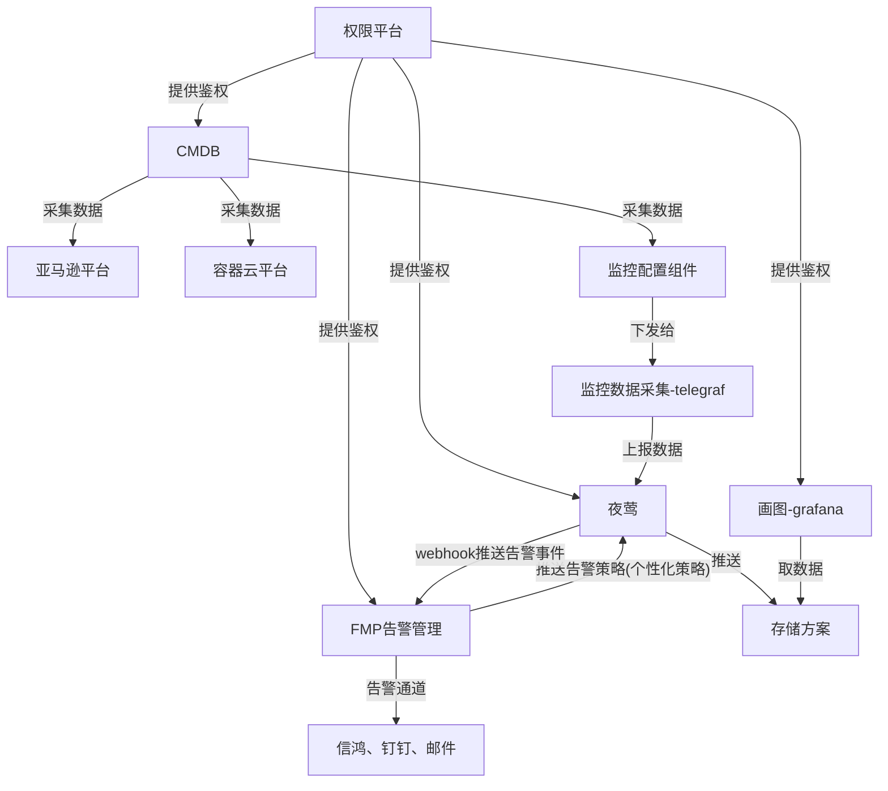

# 海外监控总体设计

## 一、架构图

v5 就不要 cmdb 推送告警策略这条线

## 二、当前需要解决的问题

### 1. 资产数据采集

亚马逊平台：

- EC2，MySQL，redis，kafka 等（这部分需要一一核实补全）
- 这部分要重新设计 model 和采集方案

容器云平台：

- 微服务，k8s 组件等（需要核实补全）
- 数据同步到夜莺平台
  v4 是有资产管理这一部分，当前 v4 上还有一套当前服务器的列表。而 v5 没有，v5 只有监控数据这一说法，所有的主机信息都作为 tag 放到监控数据中了
  v4 这里，既有事实存在的主机，也有服务虚拟出来的主机

### 2. 告警策略

- 策略的迁移
  夜莺 v4 和 v5 的策略配置改动较大需要探讨迁移方案，如果不是太复杂，使用 v5，同时把国内的也搞过来

  1. **梳理策略**
  2. telegraf 有没有采集

  - 有采集就得写出相应的策略
  - 没有采集，就需要 plugin 或者集中监控工具

- 告警发送
  fmp 需要适配 v5 的告警数据格式，保证原有功能正常（例如告警合并、告警级别调整、告警忽略、告警邮件）
  通过 webhook 直接调 fmp 就行了

### 3. 告警数据存储——现成的

夜莺 v4——m3db、或者 opentsdb
夜莺 v5——VictoriaMetric
如果使用 v4，要尽可能改造夜莺，使之能推送 Prometheus 格式数据。不然的话，使用 m3db 或者 opentsdb 都太复杂了

### 4. 接口统计及监控——和国内相同

需要确认海外日志的上报方案，是否和国内相同，还是有自己的一套。
相同的话，就按照国内的逻辑做。从 clickhouse 取，然后写 VictoriaMetric

### 5. 监控数据采集

监控数据分三部分，

1. 一部分是 agent 默认带的一堆系统运行数据；
   telegraf 已经支持，需要配置一下
2. 一部分是 agent 的 plugin 采集的部分；
   **需要测试**。
3. 还有集中监控的一部分——MySQL、redis
   cmdb 生成 telegraf 配置文件，同步到 telegraf。如果没有就用 plugin。
   一个中间件一个 telegraf，多目录、独立部署

### 6. agent 和 plugin 的分发

就是 telegraf 的远程安装。还有一个 telegraf 的配置文件的自动生成。telegraf 采集什么数据是靠自身的配置文件决定，这就意味着要能够批量修改配置

agent 的安装：cmdb 生成 ansible 配置，然后 ansible 定时分发
agent 的工具脚本：

1. 检查 agent 执行状态
2. 更新 plugin
   走 git；分发 agent 的时候，有脚本去拉取

### 7. 需要一台中控机

## 三、问题解决

### 3.1 `2.2.1` 中策略梳理

夜莺 v4 中共有策略 2393 条，去重后 503 条。其中日志策略 353。

v5 中在 alert_rule 表：
prom_eval_interval 表示检测频率，对应 v4 的 stra 中 alert_dur
prom_for_duration 表示持续时长，在 v4 中没有对应，v4 是在 exprs 中的 func 来记录，all-连续发生；diff 徒增突降；happen 发生次数等。暂时全按 all 处理，其余的不多，单独处理也行

### 3.2 `2.2.2` 中 telegraf 采集项

1. 有 activemq 相关配置
   似乎是配上就能采集，这样的话，就不需要原来 mq 相关的 plugin 了
   **不用想了，线上的 mq /admin/xml/queues.jsp 这个地址 xml 解析错误。因为它的标签里面有冒号。有冒号需要特殊处理，而 telegraf 没有这个功能**
2. 系统参数采集比原来多，没有问题，就是要稍微对一下名字
3. plugin 部分
   **有很多问题：**

   1. 上报数据格式
      确实可以用 json，但是这个格式里面没有 metric，只有 tag 和 value，且 tag 和 value 都可以是多个值。
   2. metric 的值
      telegraf 把 metric 放到配置文件里面去了。
      没有 name_override 这个字段，则默认为 input.\*\*\*\*的\*\*\*\*加 value 对应的 key 的名字。\[\[input.exec]]，value 对应的 key 名字是 value，metric 就是 exec_value
   3. tag
      上报数据字段中，除了 value，就是 tag。value 是通过字段值的类型判断的，即只要是数字，不管是 int、float 都是 value；只要是字符串，就都是 tag。
      但是 tag 的定义是有前置条件的，只有在配置文件中明确说明是 tag，telegraf 才会把它提取出来，否则丢弃。对应配置项为：**tag_keys = ["", ......]**。

   **对应要进行处理的工作就有：**

   1. 修改现有 plugin 脚本的输出格式
      主要工作是 tag 格式，现在 tag 格式是<b>"tags"="a=b,c=d,e=f"</b>
   2. metric 的值
      metric 不需要改脚本，但是要配置 telegraf 的配置文件，即每一个脚本都要单独配置。
   3. tag
      要在 telegraf 的配置文件里面配上 tag 的名字

   总体上讲，工作量很大。

### 3.3 自研一套脚本管理模块对接到夜莺 v5

大致功能：脚本管理系统、脚本数据获取接口、agent

#### 3.3.1 脚本管理系统

包括：脚本本身的存储、脚本相关参数的保存、脚本分发
~~脚本本身可以沿用现有方式，使用 git。分发时通过 git 拉取。~~
git 废掉，搞个下载接口

脚本相关参数：
执行间隔、执行脚本的位置、绑定的主机

#### 3.3.2 脚本数据获取接口

为 agent 提供数据支持，agent 通过这个获取当前主机要执行的脚本，以及执行规则。——这个地方执行间隔可以放到脚本名字里面，或者从接口获取

#### 3.3.3 agent

1. 常驻进程，且能定时发送自己的状态
2. 定期获取脚本执行参数，保证 server 端的变动能在一定延时时间内拿到
3. 能够自行计时，不同时间间隔的脚本，能够按照要求按时执行

#### 3.3.4 问题

1. **这样的话，telegraf 还用不用了？**
   讨论的初步结果是自己写 agent。把夜莺 v4 关于 plugin 执行的部分，添加到 telegraf 的逻辑里面。这部分逻辑实现：
   - 从 fmp 拉取执行策略。本机执行哪些插件
   - 本机执行插件
   - 本机插件更新
   - 或许有插件拉取。这个待定，看是主动推送好，还是自己去拉取好。
     某种意义上讲，自己拉似乎更好，就只拉自己用的。——这又涉及删除问题
2. 还有，这个问题原来就存在，当时没有想到
   原来是 cmdb 生成采集配置，现在 cmdb 有一份服务列表，fmp 有一份监控采集项列表，这两份要合并起来，才能全覆盖要采集的监控项。比方：kafka 在 cmdb，日志监控在 fmp，这就在两个地方了。如何合并
   ——这个问题讨论过了，fmp 有一套全的，直接从 fmp 拉

## 四、工作任务列表

### 1、完成 CMDB 关于获取 AWS 设备信息的功能

这个原来有，现在要重构。可以参考一下

### 2、开发一个监控配置组件

功能：

- 可以生成 telegraf 配置文件，并分发或者提供接口给各个 telegraf
- 单独弄 telegraf 集中监控
- 可以配置哪些 plugin 在哪些设备上执行
- 可以配置个性化告警策略，并推送给夜莺——日志、接口、topic——拖
- 从 cmdb 获取信息，生成配置文件——拖

### 3、把国内 IDC 的告警策略同步到海外环境

需要把 sql 整出来

### 4、telegraf 改造——先做

- 把夜莺 v4 的 agent 的功能，挪过来。
  这个在本地缓存里面留一份，缓存时间 10 分钟。超过 10 分钟，从 server 端拉取新的，并更新缓存。

### 5、ansible 分发 agent

- agent 下发
- plugin 下发
- 配置下发

### 6、云内服务搭建

| 服务               | 资源                                             |
| ------------------ | ------------------------------------------------ |
| fmp                | 0.5C0.5G                                         |
| fmp-web            | 0.5C0.5G                                         |
| cmdb               | 1C1G                                             |
| cmdb-web           | 0.5C0.5G                                         |
| receiveAlarm       | 1C1G                                             |
| telegraf 集中监控  | 0.5C0.5G 每类中间件一个：MySQL，redis、kafka、es |
| VictoriaMetric     | 2C2G                                             |
| vm-agent           | 1C1G                                             |
| grafana            | 1C1G                                             |
| node-exporter      | 1C1G                                             |
| kubesystem-metrics | 1C1G                                             |
| ldap               | 1C1G GFS                                         |
| nginx              | 1C1G                                             |
| n9e-v5 webapi      | 1C1G                                             |
| n9e-v5 server-api  | 3C3G                                             |
| 中控机             | 4C8G                                             |
| realtime           | 1C1G ——看接口数量                                |

- harbor 上占用一部分存储，放监控数据——vm-storage（云外）
