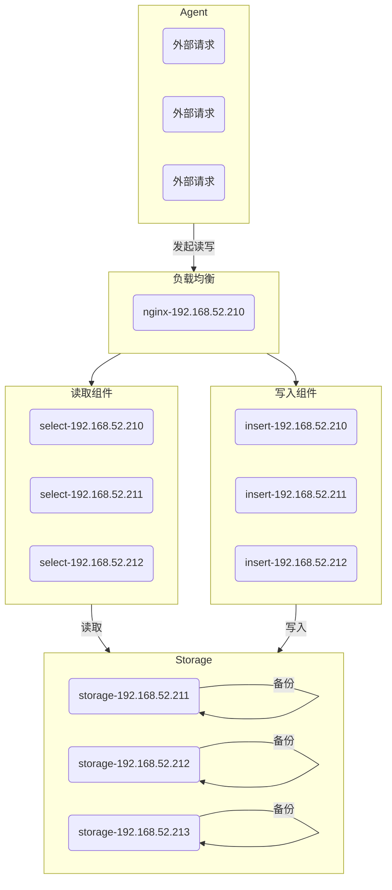

### 组网图



### 启动脚本

注意：storage 的读写走的是不同的端口，所以启动 select 和 insert 的时候，要区分开

```shell
#!/bin/bash
case $1 in
"select")
nohup ./vmselect-prod -storageNode=127.0.0.1:8401 -replicationFactor=1 -search.denyPartialResponse > logs/select.output &
echo "start select"
;;
"insert")
nohup ./vminsert-prod -storageNode=127.0.0.1:8400 -replicationFactor=1 -opentsdbHTTPListenAddr=:4242 > logs/insert.output &
echo "start insert"
;;
"storage")
nohup ./vmstorage-prod -retentionPeriod=30d > logs/storage.output &
echo "start storage"
;;
*)
echo "invalid value: $1"
echo "available choices: select, insert, storage"
;;
esac
```

### 停止脚本

这里就直接杀，不带 9。如果干不掉，再加上 -9

```shell
#!/bin/bash

case $1 in
"select")
ps -ef | grep 'vmselect-prod' | grep -v grep | awk '{print $2}' | xargs kill
echo "stop select"
;;
"insert")
ps -ef | grep 'vminsert-prod' | grep -v grep | awk '{print $2}' | xargs kill
echo "stop insert"
;;
"storage")
ps -ef | grep 'vmstorage-prod' | grep -v grep | awk '{print $2}' | xargs kill
echo "stop storage"
;;
*)
echo "valid value: select, insert, storage"
;;
esac
```

### 请求样式

1. opentsdb
   必须在 insert 启动参数重增加，`-opentsdbHTTPListenAddr=:4242`，主要是端口号。这个是 http 的端口，insert 还提供了一个 telnet 的端口，那个不用管，日常也用不到。
   请求长这样：`http://10.18.216.65:4242/insert/1/opentsdb/api/put`

### nginx 配置

如果使用集群，前端所有请求必然要走负载均衡。目前采用的 nginx 实现。
这里就有问题，如果启动 opentsdb，就必须把这部分请求，从原 insert 路径转发到后端的 4242，而不是 8480(insert 的默认端口)
重点是`~*`，不能用`^~`。`^~`就是匹配到指定的字符串就停，不管后面还有什么。针对这个情况，其优先级要比～\*高，永远也到不了.

server.conf

```server.conf
server {
    listen       80 ;

    location ~* /insert/[0-9]+/opentsdb {
        proxy_pass http://vminsert_opentsdb;
    }

    location ~* /insert {
        proxy_pass http://vminsert;
    }

    location ~* /select {
        proxy_pass http://vmselect;
    }

    location / {
        return 200 "qunimagebide\n";
    }
}
```

upstream.conf

```upstream.conf
upstream vmselect {
    server 192.168.52.210:8481;
    server 192.168.52.211:8481;
    server 192.168.52.212:8481;
}

upstream vminsert {
    server 192.168.52.210:8480;
    server 192.168.52.211:8480;
    server 192.168.52.212:8480;
}

upstream vminsert_opentsdb {
    server 192.168.52.210:4242;
    server 192.168.52.211:4242;
    server 192.168.52.212:4242;
}
```
