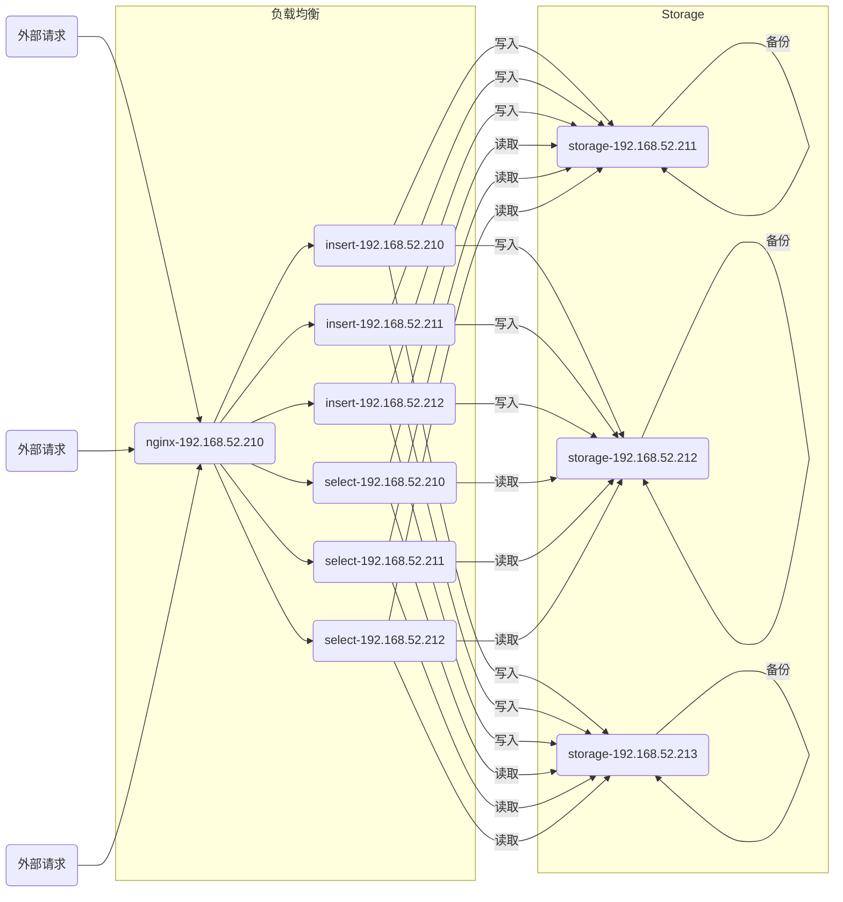

```mermaid
graph LR;

A1(外部请求)-->B
A2(外部请求)-->B
A3(外部请求)-->B
subgraph 负载均衡
B(nginx-192.168.52.210)-->C1(insert-192.168.52.210)
B(nginx-192.168.52.210)-->C2(insert-192.168.52.211)
B(nginx-192.168.52.210)-->C3(insert-192.168.52.212)
B-->D1(select-192.168.52.210)
B-->D2(select-192.168.52.211)
B-->D3(select-192.168.52.212)
end

subgraph Storage
C1--写入-->E1(storage-192.168.52.211)
C1--写入-->E2(storage-192.168.52.212)
C1--写入-->E3(storage-192.168.52.213)
C2--写入-->E1(storage-192.168.52.211)
C2--写入-->E2(storage-192.168.52.212)
C2--写入-->E3(storage-192.168.52.213)
C3--写入-->E1(storage-192.168.52.211)
C3--写入-->E2(storage-192.168.52.212)
C3--写入-->E3(storage-192.168.52.213)
D1--读取-->E1(storage-192.168.52.211)
D1--读取-->E2(storage-192.168.52.212)
D1--读取-->E3(storage-192.168.52.213)
D2--读取-->E1(storage-192.168.52.211)
D2--读取-->E2(storage-192.168.52.212)
D2--读取-->E3(storage-192.168.52.213)
D3--读取-->E1(storage-192.168.52.211)
D3--读取-->E2(storage-192.168.52.212)
D3--读取-->E3(storage-192.168.52.213)
E1--备份-->E1
E2--备份-->E2
E3--备份-->E3
end

```
