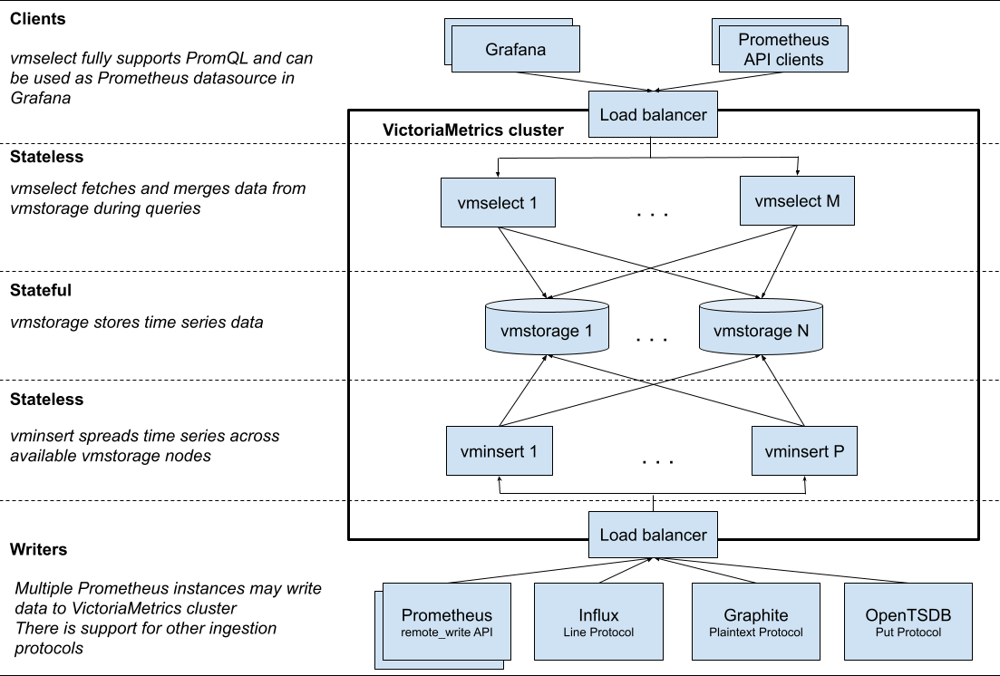

> The needed storage space for the given retention (the retention is set via -retentionPeriod command-line flag at vmstorage) can be extrapolated from disk space usage in a test run. For example, if the storage space usage is 10GB after a day-long test run on a production workload, then it will need at least 10GB\*100=1TB of disk space for -retentionPeriod=100d (100-days retention period). Storage space usage can be monitored with the official Grafana dashboard for VictoriaMetrics cluster.

这个意思启动的时候有个参数 -retentionPeriod。这个是用来决定数据保留多少天的。例子是说，一天 10GB，100 天就是 1TB。所以设置参数 -retentationPeriod=100d

---

#### 参数的设置

一是通过启动命令来控制。具体的参数可以通过，启动命令 -h，来看。特别多
二是通过环境变量。
环境变量有个要注意的地方。环境变量里面的"."，要换成"\_"

---

# 一、VictoriaMetric

## How to start VictoriaMetrics

### Environment variables

Each flag value can be set via environment variables according to these rules:

- The <font color="red">-envflag.enable</font> flag must be set.
- Each <font color="red">.</font> char in flag name must be substituted with <font color="red">\_</font> (for example <font color="red">-insert.maxQueueDuration \<duration></font> will translate to <font color="red">insert_maxQueueDuration=\<duration></font>).
- For repeating flags an alternative syntax can be used by joining the different values into one using <font color="red">,</font> char as separator (for example <font color="red">-storageNode \<nodeA> -storageNode \<nodeB> will translate to storageNode=\<nodeA>,\<nodeB></font>).
- Environment var prefix can be set via <font color="red">-envflag.prefix</font> flag. For instance, if <font color="red">-envflag.prefix=VM*</font>, then env vars must be prepended with <font color="red">VM*</font>.

重点：命令行必须要有 envflag.enable，不然不认识环境变量；同一个 flag 可以多次输入，值不同会自动用逗号替换；如果定义了前缀，那每个环境变量都要有相应的前缀

# 二、Cluster version



## Architecture overview

VictoriaMetrics cluster consists of the following services:

- vmstorage - stores the raw data and returns the queried data on the given time range for the given label filters
  vmstorage 用来存储和在规定时间内返回请求的数据
- vminsert - accepts the ingested data and spreads it among vmstorage nodes according to consistent hashing over metric name and all its labels
  接收数据并把它们根据 metric name 和所有标签的哈希一致性分发到 vmstorage 上
- vmselect - performs incoming queries by fetching the needed data from all the configured vmstorage nodes
  将需要的数据从 vmstorage 取出来

Each service may scale independently and may run on the most suitable hardware. vmstorage nodes don't know about each other, don't communicate with each other and don't share any data. This is shared nothing architecture. It increases cluster availability, simplifies cluster maintenance and cluster scaling.

## Multitenancy

VictoriaMetrics cluster supports multiple isolated tenants (aka namespaces). Tenants are identified by accountID or accountID:projectID, which are put inside request urls. See these docs for details. Some facts about tenants in VictoriaMetrics:

- Each <font color="red">accountID</font> and <font color="red">projectID</font> is identified by an arbitrary 32-bit integer in the range <font color="red">[0 .. 2^32)</font>. If <font color="red">projectID</font> is missing, then it is automatically assigned to <font color="red">0</font>. It is expected that other information about tenants such as auth tokens, tenant names, limits, accounting, etc. is stored in a separate relational database. This database must be managed by a separate service sitting in front of VictoriaMetrics cluster such as vmauth or vmgateway. Contact us if you need assistance with such service.
  就是说，这个 accountID 必须要有，projectID 可以没有。这东西在<a href="#vmauth">vmauth</a>、<a href="#vmgateway">vmgateway</a> 里面用到了。
- Tenants are automatically created when the first data point is written into the given tenant.
  租户会在第一次数据写入时自动创建。
- Data for all the tenants is evenly spread among available vmstorage nodes. This guarantees even load among vmstorage nodes when different tenants have different amounts of data and different query load.
- The database performance and resource usage doesn't depend on the number of tenants. It depends mostly on the total number of active time series in all the tenants. A time series is considered active if it received at least a single sample during the last hour or it has been touched by queries during the last hour.
- VictoriaMetrics doesn't support querying multiple tenants in a single request.
  各个租户数据独立，不能在一次请求中都返回

## 集群部署(Cluster setup)

A minimal cluster must contain the following nodes:

1. a single <font color="red">vmstorage</font> node with <font color="red">-retentionPeriod</font> and <font color="red">-storageDataPath</font> flags
2. a single <font color="red">vminsert</font> node with <font color="red">-storageNode=<vmstorage_host></font>
3. a single <font color="red">vmselect</font> node with <font color="red">-storageNode=<vmstorage_host></font>

这个地方，感觉是这三个服务需要配套。一一对应的话，存储的数据是否共通，启动的时候，参数要怎么写？

> 这个地方不是对应的。insert 和 select 是完全独立的两个功能不同的组件，他两个都和 storage 有关联。

It is recommended to run at least two nodes for each service for high availability purposes.
为了高可用，建议每个服务至少在 2 个 node 上运行
An http load balancer such as vmauth or nginx must be put in front of vminsert and vmselect nodes. It must contain the following routing configs according to the url format:
一个 http 负载均衡必须放在 vminsert 和 vmselect 的前面。必须包含一下路由：

- requests starting with <font color="red">/insert</font> must be routed to port <font color="red">8480</font> on <font color="red">vminsert</font> nodes.
- requests starting with <font color="red">/select</font> must be routed to port <font color="red">8481</font> on <font color="red">vmselect</font> nodes.

Ports may be altered by setting <font color="red">-httpListenAddr</font> on the corresponding nodes.

## Cluster resizing and scalability

Cluster performance and capacity scales with adding new nodes.

1. <font color="red">vminsert</font> and <font color="red">vmselect</font> nodes are stateless and may be added / removed at any time. Do not forget updating the list of these nodes on http load balancer. Adding more <font color="red">vminsert</font> nodes scales data ingestion rate. See this comment about ingestion rate scalability. Adding more <font color="red">vmselect</font> nodes scales select queries rate.
   vminsert 和 vmselect 是无状态的，可以随意增减。
2. <font color="red">vmstorage</font> nodes own the ingested data, so they cannot be removed without data loss. Adding more <font color="red">vmstorage</font> nodes scales cluster capacity.
   vmstorage 是和数据绑定的，所以不能减，只能增。(这样的话，节点坏了怎么办)

Steps to add <font color="red">vmstorage</font> node:
添加 vmstorage 的步骤：

1. Start new <font color="red">vmstorage</font> node with the same <font color="red">-retentionPeriod</font> as existing nodes in the cluster.
   增加 vmstorage，参数和现有的一致
2. Gradually restart all the <font color="red">vmselect</font> nodes with new <font color="red">-storageNode</font> arg containing <font color="red"><new_vmstorage_host></font>.
   随意重启 vmselect，要带上-storageNode 这个参数，并把新的 vmstorage node 加上
3. Gradually restart all the <font color="red">vminsert</font> nodes with new <font color="red">-storageNode</font> arg containing <font color="red"><new_vmstorage_host></font>.
   随意重启 vminsert，要带上-storageNode 这个参数，并把新的 vmstorage node 加上

## Cluster availability

HTTP load balancer must stop routing requests to unavailable <font color="red">vminsert</font> and <font color="red">vmselect</font> nodes.
http 负载均衡器必须停止到到不可用 vminsert 和 vmselect 节点的路由
The cluster remains available if at least a single vmstorage node exists:
只要一个 vmstorage 节点存在，集群即保持可用

1. vminsert re-routes incoming data from unavailable vmstorage nodes to healthy vmstorage nodes
   vminsert 会把进来的数据从不可用 vmstorage 重新路由到健康的节点
2. vmselect continues serving partial responses if at least a single vmstorage node is available. If consistency over availability is preferred, then either pass -search.denyPartialResponse command-line flag to vmselect or pass deny_partial_response=1 query arg in requests to vmselect.
   如有有一个 vmstorage 节点是可用的，vmselect 会继续提供部分响应。如果数据一致性要求大于可用性，则可以加上参数<font color="red">-search.denyPartialResponse</font>，或者在请求参数里面加上<font color="red">deny_partial_response=1</font>

vmselect doesn't serve partial responses for API handlers returning raw datapoints - /api/v1/export\* endpoints, since users usually expect this data is always complete.

Data replication can be used for increasing storage durability. See these docs for details.
数据备份可用于不断增长的存储耐久。(我估计就是考虑磁盘坏了)

## Replication and data safety

By default VictoriaMetrics offloads replication to the underlying storage pointed by -storageDataPath.
VictoriaMetric 把备份转嫁到下层的标记了<font color="red">-strorageDataPath</font>的存储上。

> The replication can be enabled by passing -replicationFactor=N command-line flag to vminsert. This guarantees that all the data remains available for querying if up to N-1 vmstorage nodes are unavailable. The cluster must contain at least 2*N-1 vmstorage nodes, where N is replication factor, in order to maintain the given replication factor for newly ingested data when N-1 of storage nodes are lost. For example, when -replicationFactor=3 is passed to vminsert, then it replicates all the ingested data to 3 distinct vmstorage nodes, so up to 2 vmstorage nodes can be lost without data loss. The minimum number of vmstorage nodes should be equal to 2*3-1 = 5, so when 2 vmstorage nodes are lost, the remaining 3 vmstorage nodes could provide the -replicationFactor=3 for newly ingested data.

备份可以通过参数<font color="red">-replicationFactor=N</font>传递给 vminsert。这样可以保证只要有一个 vmstorage 可用，请求数据的访问就可用。集群必须至少包含 2N-1 个 vmstorage 节点，N 是备份数量，以此保证当只有一个 vmstorage 活着的时候系统可用。当<font color="red">-replicationFactor=3</font>传递给 vminsert，所有收到的数据会被传给 3 个不同的 vmstorage 节点，这样最多可以有 2 个 vmstorage 节点可以挂掉而不丢数据。最小 vmstorage 节点数量应该是 2\*3-1=5，所以当 2 个 vmstorage 节点丢失，还有 3 个节点可以提供服务

> When the replication is enabled, -dedup.minScrapeInterval=1ms command-line flag must be passed to vmselect nodes. Optional -replicationFactor=N command-line flag can be passed to vmselect for improving query performance when up to N-1 vmstorage nodes respond slowly and/or temporarily unavailable, since vmselect doesn't wait for responses from up to N-1 vmstorage nodes. Sometimes -replicationFactor at vmselect nodes can result in partial responses. See this issues for details. The -dedup.minScrapeInterval=1ms de-duplicates replicated data during queries. If duplicate data is pushed to VictoriaMetrics from identically configured vmagent instances or Prometheus instances, then the -dedup.minScrapeInterval must be set to bigger values according to deduplication docs.

当备份被启用的时候，<font color="red">-dedup.minScrapelnteval=1ms</font>这个参数必须传给 vmselect 节点。当多达 N-1 个 vmstorage 节点相应慢或者暂时不可用，<font color="red">-replicationFactor=N</font>可以传给 vmselect，来提高请求性能。应为 vmselect 不会等待从 N-1 个 vmstorage 节点来的响应。有时候，在 vmselect 节点的<font color="red">-replicationFactor</font>参数，会导致不完整的响应。具体原因再翻译。后面的就彻底没看明白。
Note that replication doesn't save from disaster, so it is recommended performing regular backups. See these docs for details.

> Note that the replication increases resource usage - CPU, RAM, disk space, network bandwidth - by up to -replicationFactor times. So it may be worth offloading the replication to underlying storage pointed by -storageDataPath such as Google Compute Engine persistent disk, which is protected from data loss and data corruption. It also provide consistently high performance and may be resized without downtime. HDD-based persistent disks should be enough for the majority of use cases.

就是可以使用网络硬盘
It is recommended using durable replicated persistent volumes in Kubernetes.

## Backups

It is recommended performing periodical backups from instant snapshots for protecting from user errors such as accidental data deletion.

The following steps must be performed for each vmstorage node for creating a backup:

1. Create an instant snapshot by navigating to /snapshot/create HTTP handler. It will create snapshot and return its name.
2. Archive the created snapshot from <-storageDataPath>/snapshots/<snapshot_name> folder using vmbackup. The archival process doesn't interfere with vmstorage work, so it may be performed at any suitable time.
3. Delete unused snapshots via /snapshot/delete?snapshot=<snapshot_name> or /snapshot/delete_all in order to free up occupied storage space.

There is no need in synchronizing backups among all the vmstorage nodes.

Restoring from backup:

1. Stop vmstorage node with kill -INT.
2. Restore data from backup using <a href="#vmrestore">vmrestore</a> into -storageDataPath directory.
3. Start vmstorage node.

# 五、<h id="vmauth">vmauth</h>

<font color="red">vmauth</font> is a simple auth proxy, router and load balancer for VictoriaMetrics. It reads auth credentials from Authorization http header (Basic Auth and Bearer token is supported), matches them against configs pointed by -auth.config command-line flag and proxies incoming HTTP requests to the configured per-user url_prefix on successful match. The <font color="red">-auth.config</font> can point to either local file or to http url.
vmauth 是一个针对 VictoriaMetric 的简单的权限代理、路由、负载均衡。他从 http header 里面读取身份信息。

## Quick start

Just download <font color="red">vmutils-\*</font> archive from releases page, unpack it and pass the following flag to vmauth binary in order to start authorizing and routing requests:

```
/path/to/vmauth -auth.config=/path/to/auth/config.yml
```

After that vmauth starts accepting HTTP requests on port <font color="red">8427</font> and routing them according to the provided -auth.config. The port can be modified via -httpListenAddr command-line flag.
注意端口号

## Auth config

header 样例：Authorization: Bearer `QWER`

<font color="red">-auth.config</font> is represented in the following simple <font color="red">yml</font> format:

```yml
# Arbitrary number of usernames may be put here.
# Username and bearer_token values must be unique.

users:
  # Requests with the 'Authorization: Bearer XXXX' header are proxied to http://localhost:8428 .
  # For example, http://vmauth:8427/api/v1/query is proxied to http://localhost:8428/api/v1/query
  # Requests with the Basic Auth username=XXXX are proxied to http://localhost:8428 as well.
  - bearer_token: "XXXX"
    url_prefix: "http://localhost:8428"

    # Requests with the 'Authorization: Bearer YYY' header are proxied to http://localhost:8428 ,
    # The `X-Scope-OrgID: foobar` http header is added to every proxied request.
    # For example, http://vmauth:8427/api/v1/query is proxied to http://localhost:8428/api/v1/query
  - bearer_token: "YYY"
    url_prefix: "http://localhost:8428"
    headers:
      - "X-Scope-OrgID: foobar"

    # The user for querying local single-node VictoriaMetrics.
    # All the requests to http://vmauth:8427 with the given Basic Auth (username:password)
    # will be proxied to http://localhost:8428 .
    # For example, http://vmauth:8427/api/v1/query is proxied to http://localhost:8428/api/v1/query
  - username: "local-single-node"
    password: "***"
    url_prefix: "http://localhost:8428"

    # The user for querying local single-node VictoriaMetrics with extra_label team=dev.
    # All the requests to http://vmauth:8427 with the given Basic Auth (username:password)
    # will be routed to http://localhost:8428 with extra_label=team=dev query arg.
    # For example, http://vmauth:8427/api/v1/query is routed to http://localhost:8428/api/v1/query?extra_label=team=dev
  - username: "local-single-node"
    password: "***"
    url_prefix: "http://localhost:8428?extra_label=team=dev"

    # The user for querying account 123 in VictoriaMetrics cluster
    # See https://docs.victoriametrics.com/Cluster-VictoriaMetrics.html#url-format
    # All the requests to http://vmauth:8427 with the given Basic Auth (username:password)
    # will be load-balanced among http://vmselect1:8481/select/123/prometheus and http://vmselect2:8481/select/123/prometheus
    # For example, http://vmauth:8427/api/v1/query is proxied to the following urls in a round-robin manner:
    #   - http://vmselect1:8481/select/123/prometheus/api/v1/select
    #   - http://vmselect2:8481/select/123/prometheus/api/v1/select
  - username: "cluster-select-account-123"
    password: "***"
    url_prefix:
      - "http://vmselect1:8481/select/123/prometheus"
      - "http://vmselect2:8481/select/123/prometheus"

    # The user for inserting Prometheus data into VictoriaMetrics cluster under account 42
    # See https://docs.victoriametrics.com/Cluster-VictoriaMetrics.html#url-format
    # All the requests to http://vmauth:8427 with the given Basic Auth (username:password)
    # will be load-balanced between http://vminsert1:8480/insert/42/prometheus and http://vminsert2:8480/insert/42/prometheus
    # For example, http://vmauth:8427/api/v1/write is proxied to the following urls in a round-robin manner:
    #   - http://vminsert1:8480/insert/42/prometheus/api/v1/write
    #   - http://vminsert2:8480/insert/42/prometheus/api/v1/write
  - username: "cluster-insert-account-42"
    password: "***"
    url_prefix:
      - "http://vminsert1:8480/insert/42/prometheus"
      - "http://vminsert2:8480/insert/42/prometheus"

    # A single user for querying and inserting data:
    # - Requests to http://vmauth:8427/api/v1/query, http://vmauth:8427/api/v1/query_range
    #   and http://vmauth:8427/api/v1/label/<label_name>/values are proxied to the following urls in a round-robin manner:
    #     - http://vmselect1:8481/select/42/prometheus
    #     - http://vmselect2:8481/select/42/prometheus
    #   For example, http://vmauth:8427/api/v1/query is proxied to http://vmselect1:8480/select/42/prometheus/api/v1/query
    #   or to http://vmselect2:8480/select/42/prometheus/api/v1/query .
    # - Requests to http://vmauth:8427/api/v1/write are proxied to http://vminsert:8480/insert/42/prometheus/api/v1/write .
    #   The "X-Scope-OrgID: abc" http header is added to these requests.
  - username: "foobar"
    url_map:
      - src_paths:
          - "/api/v1/query"
          - "/api/v1/query_range"
          - "/api/v1/label/[^/]+/values"
        url_prefix:
          - "http://vmselect1:8481/select/42/prometheus"
          - "http://vmselect2:8481/select/42/prometheus"
      - src_paths: ["/api/v1/write"]
        url_prefix: "http://vminsert:8480/insert/42/prometheus"
        headers:
          - "X-Scope-OrgID: abc"
```

# 七、<h id="vmrestore">vmrestore</h>

vmrestore restores data from backups created by vmbackup. VictoriaMetrics v1.29.0 and newer versions must be used for working with the restored data.

Restore process can be interrupted at any time. It is automatically resumed from the interruption point when restarting vmrestore with the same args.

## Usage

VictoriaMetrics must be stopped during the restore process.

```shell
vmrestore -src=gs://<bucket>/<path/to/backup> -storageDataPath=<local/path/to/restore>
```

- <font color="red">\<bucket></font> is GCS bucket name.
- <font color="red"><path/to/backup></font> is the path to backup made with vmbackup on GCS bucket.
- <font color="red"><local/path/to/restore></font> is the path to folder where data will be restored. This folder must be passed to VictoriaMetrics in <font color="red">-storageDataPath</font> command-line flag after the restore process is complete.

The original -storageDataPath directory may contain old files. They will be substituted by the files from backup, i.e. the end result would be similar to rsync –delete.
恢复数据的时候需要指定恢复的位置，原位置可能会有旧文件干扰，最好都干掉。

## Troubleshooting

- If vmrestore eats all the network bandwidth, then set <font color="red">-maxBytesPerSecond</font> to the desired value.
  恢复的时候可以限速。毕竟从别的节点传数据
- If vmrestore has been interrupted due to temporary error, then just restart it with the same args. It will resume the restore process.
