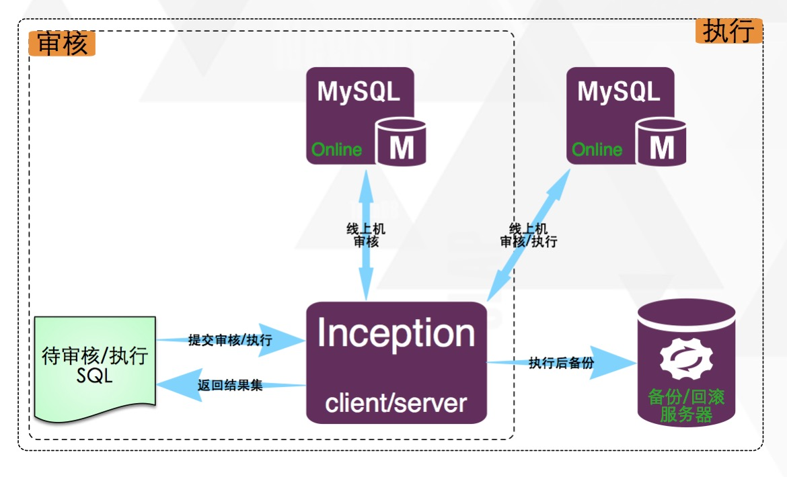

# 简介

goInception 是一个集审核、执行、备份及生成回滚语句于一身的 MySQL 运维工具， 通过对执行 SQL 的语法解析，返回基于自定义规则的审核结果，并提供执行和备份及生成回滚语句的功能。

## 架构



## 安装

GitHub：https://github.com/hanchuanchuan/goInception
应该是个华人写的。
里面有 release 库，直接下载即可。解压直接用。
里面有一个目录和一个文件。目录里面是配置文件模板；文件是编译好的可执行文件。
启动：

```
./goInception --config=config/config.toml
```

## 配置

##### path

定义 goInception 自己的数据库位置。数据量很少，会初始化一点数据。

##### [inc]

这里面都是审核相关。backup\_\*\*\*\*四项是用来回滚的数据库信息。
